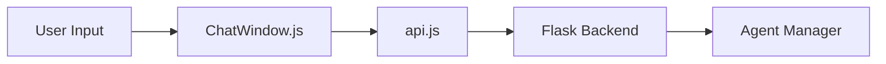
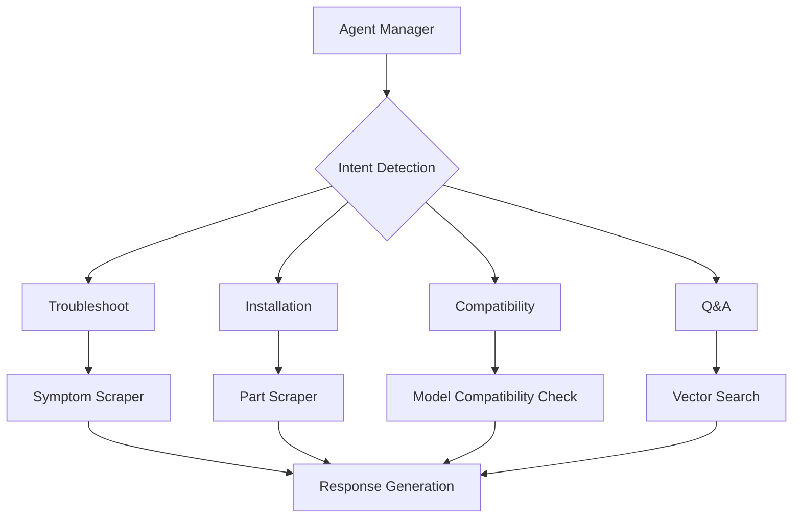

# PartSelect Appliance Assistant

## Overview
The PartSelect Appliance Assistant is a full-stack application that helps users troubleshoot appliance issues, find parts, and access repair instructions. It leverages AI for natural language processing and integrates with PartSelect's website for accurate responses.

## Tech Stack

### Frontend
- **Framework**: React.js
- **Libraries**:
  - `marked` for Markdown rendering
  - Fetch API for backend communication

### Backend
- **Framework**: Flask (Python)
- **Key Components**:
  - LangChain for AI/LLM integration
  - OpenAI's GPT-4 for intent detection and response generation
  - ChromaDB for vector storage
  - Undetected ChromeDriver for web scraping
  - Google Custom Search API for PartSelect search

### External Services
- OpenAI API (GPT-4)
- Google Custom Search API
- PartSelect website (data source)

## Data Flow

### User Input Flow

### Backend Processing Flow

## Key Components

### Vector Manager (`vector_manager.py`)
- Manages document embeddings with OpenAI models
- Implements ChromaDB for vector storage
- Handles semantic search
- Indexes data from:
  - Q&A pairs
  - Troubleshooting information
  - Model compatibility
  - Installation guides

### Agent Manager (`agent_manager.py`)
- Detects query intent using GPT-4
- Extracts model/part numbers
- Coordinates scrapers and search functions
- Maintains session context

### Scrapers
#### Symptom Scraper (`symptom_scraper.py`)
- Scrapes troubleshooting information
- Extracts user repair stories
- Handles pagination and dynamic content

#### PartSelect Scraper (`partselect_scraper.py`)
- Scrapes product details and compatibility data
- Extracts Q&A sections
- Manages troubleshooting data

### Frontend Components
#### ChatWindow (`ChatWindow.js`)
- Manages chat interface
- Renders messages with markdown formatting
- Handles API requests and loading states

## Data Processing Pipeline
1. **Query Processing**
   - Frontend sends user query to `/chat` endpoint
   - Request includes message and optional session data

2. **Intent Detection**
   - Agent Manager detects query intent using GPT-4
   - Extracts model/part numbers
   - Determines processing path

3. **Data Retrieval**
   - Searches vector store for indexed data
   - Initiates web scraping if needed
   - Performs Google Custom Search for relevant pages

4. **Response Generation**
   - Combines retrieved data with session context
   - Uses GPT-4 to generate a structured response
   - Formats response with markdown for frontend rendering

5. **Response Delivery**
   - Sends formatted response back to frontend
   - Updates conversation history and maintains session

## Environment Requirements
- Python 3.8+
- Node.js 14+
- Chrome/Chromium for scraping
- Required environment variables:
  - `OPENAI_API_KEY`
  - `GOOGLE_API_KEY`
  - `GOOGLE_CSE_ID
